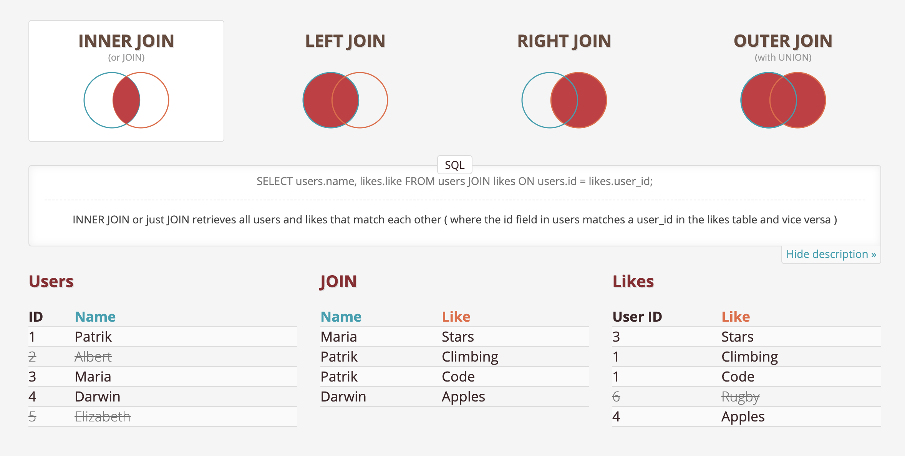

import { SQLSection } from "../components"
import { ExerciseNote } from "../components"

`JOIN` is the most important clause in SQL, it allows you ot merge one or more
tables horizontaly based on conditions.

-   `JOIN` is followed by a table name just like `FROM`
-   `JOIN` always goes after a `FROM` and it's followed by `ON`
-   `ON` is a conditional statment that indicates how the two tables relate to each other
    -   It also indicates how rows will be filtered based on the type of `JOIN` (`INNER`, `LEFT`, `RIGHT`)
-   It's a very good practice to use aliases for the tables when doing a `JOIN`
    -   `JOIN` aliases do not require `AS`, just the alias after the table name `JOIN <table> <alias>`

It's often the case that one or both tables being joined contain rows that don't have matches in the other table.

-   For example, not all students in a student table will be in the grades table (if they missed an exam).
-   The way this is handled depends on the type of `JOIN` you're making.

`INNER JOIN` is the default `JOIN` but if you want to be explicit you can say `INNER JOIN`.

-   `INNER JOIN`s eliminate rows from both tables that do not satisfy the condition in the `ON` statement.
-   An `INNER JOIN` is the intersection of the two tables

[joins.spathon.com](https://joins.spathon.com/) is an excelent resurce to understand
the different types of `JOIN`s.

---

Let's `JOIN` two of the basketball tables.

-   The `basketball_players` table that has a `state` column
-   The `basketball_state_detail` table has info about the states and an `id` column

We can `JOIN` this to tables `ON` the `state`s columns.

export const l13_q1 = `
SELECT P.name, S.name
FROM basketball_players P
JOIN basketball_state_detail S
    ON P.state_code = S.id
LIMIT 100
`

<SQLSection defaultValue={l13_q1} classes="editor-wrapper"></SQLSection>

On this query we see that if the columns with the same names (`name` in this case)
we can use `SELECT` with the alias of each table.
