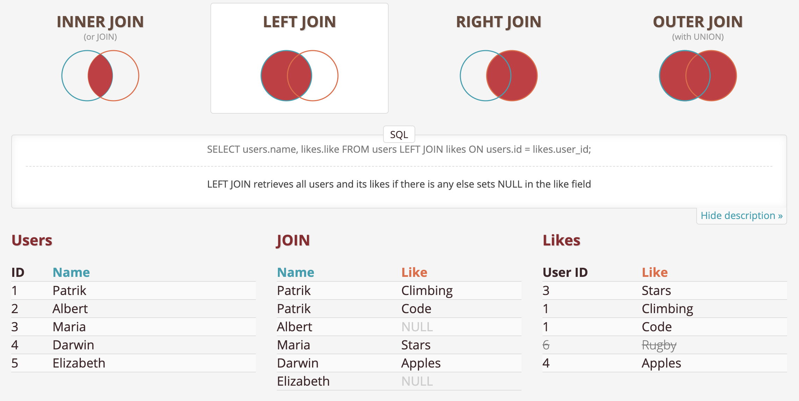
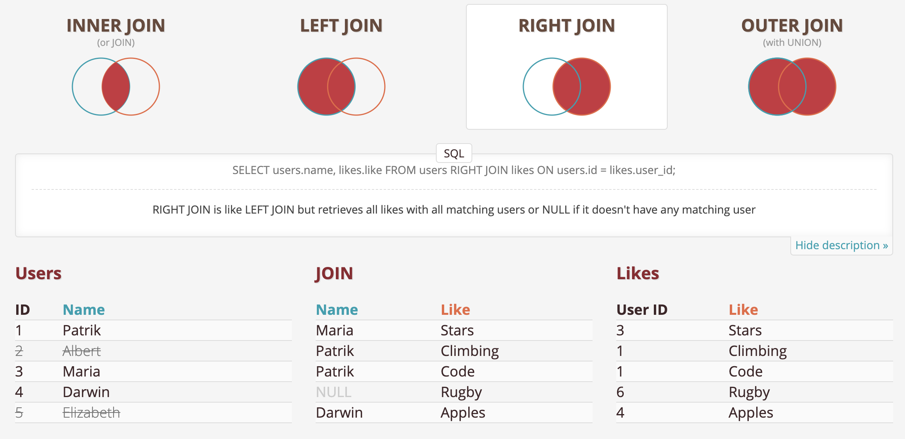

import { SQLSection } from "../components"
import { ExerciseNote } from "../components"

A `LEFT JOIN` returns any unmatched rows from the left table in addition to
the matched rows.

A `RIGHT JOIN` returns any unmatched rows from the right table in addition to
the matched rows.

---

A regular JOIN will not return any missing values (`NULL`s)

export const l14_q1 = `
SELECT P.name, S.name
FROM basketball_players P
JOIN basketball_state_detail S
    ON P.state_code = S.id
LIMIT 100
`

<SQLSection defaultValue={l14_q1} classes="editor-wrapper"></SQLSection>

Doing a `LEFT JOIN` on the other hand will return unmatches rows from the left table

export const l14_q2 = `
SELECT P.name, P.state_code, S.name
FROM basketball_players P
LEFT JOIN basketball_state_detail S
    ON P.state_code = S.id
LIMIT 100
`

<SQLSection defaultValue={l14_q2} classes="editor-wrapper"></SQLSection>

In this case this is caused because some players have a `state_code` of 0 and
there is not state with id 0 on the `basketball_state_detail` table.
