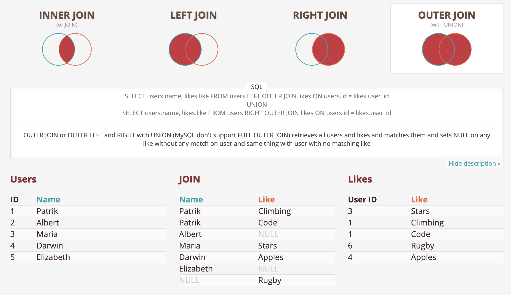

import { SQLSection } from "../components"
import { ExerciseNote } from "../components"

A `FULL JOIN` or `FULL OUTER JOIN` returns any unmatched rows from both tables in addition to
the matched rows.

-   It's not the most used
    It is commonly used in conjunction with aggregations to understand the amount of overlap between two tables.

